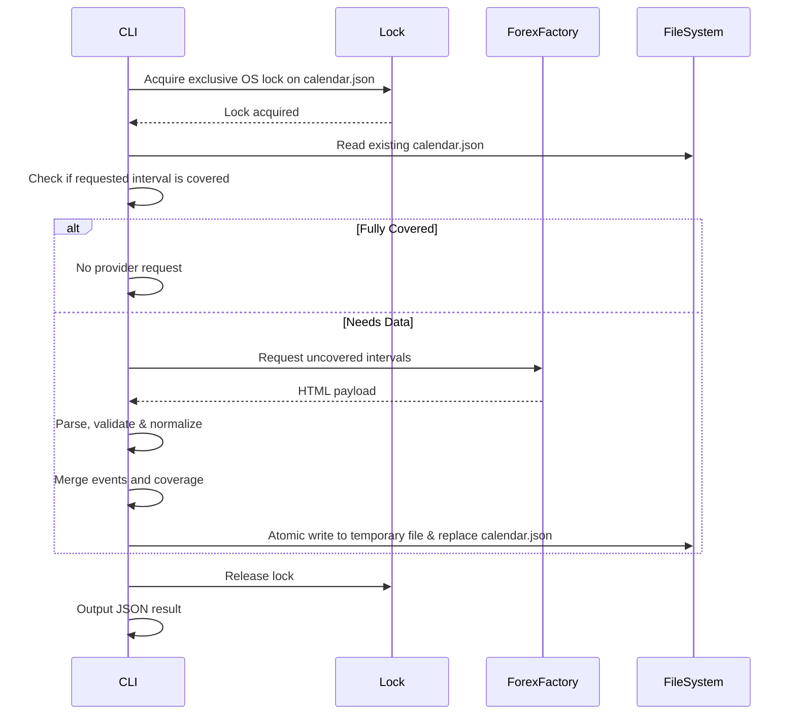
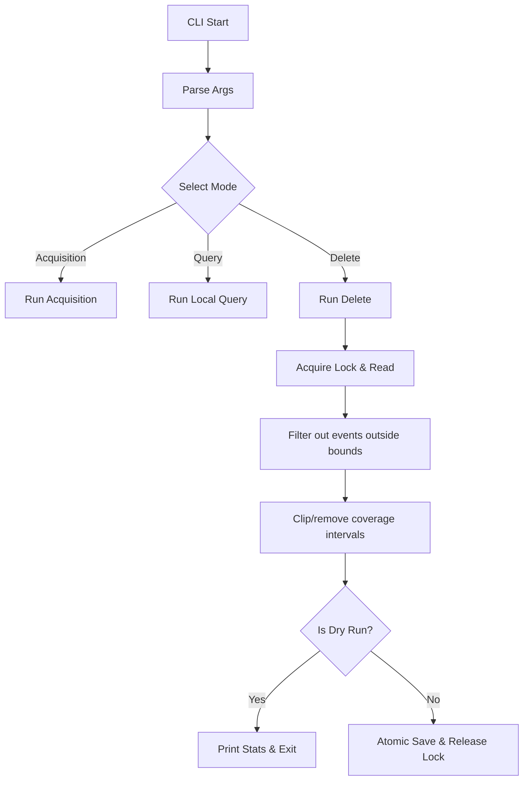
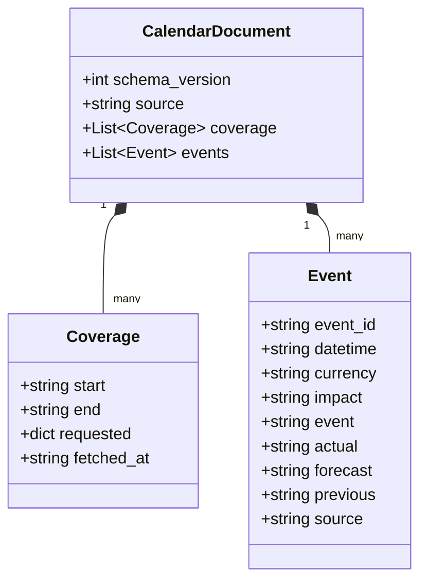

# Calendar Implementation Design

## 1. Responsibilities and Non-Responsibilities
**Responsibilities:**
- Acquire ForexFactory economic calendar data.
- Parse provider HTML payload, normalizing to UTC and stable `event_id`.
- Maintain a single global `calendar.json` with tracking for coverage intervals.
- Provide time-based local queries for FX symbols.
- Provide explicit deterministic deletion with interval coverage update.
- Ensure atomic, locked persistence of `calendar.json`.
- Fail cleanly on acquisition failures, leaving the last-known-good file intact.

**Non-Responsibilities:**
- No SMC calculation (BOS, CHoCH, IDM, Dealing Range, POI, etc.).
- No generation of symbol-specific News JSON.
- No automatic retention or cleanup.
- No evaluation of setup validity or trading decisions.

## 2. Boundaries and Dependencies
- **Inputs:** CLI arguments (Acquisition, Query, Delete boundaries), ForexFactory HTML response, existing `calendar.json`.
- **Outputs:** Console output (machine-readable JSON format for local queries), updated `calendar.json`.
- **Side effects:** File creation/atomic update of `calendar.json`, locking mechanism via OS-level file lock (`msvcrt.locking` on Windows, `fcntl` on POSIX).
- **Dependencies:** Standard library (`json`, `datetime`, `urllib.request`, `argparse`, `tempfile`, `os`, `re`).
- **Dependency Direction:** Downstream dependencies only. Calendar receives no imports from SMC modules, and SMC modules do not dictate Calendar implementation details, just consume its JSON output.

## 3. Main Execution Flows

### Acquisition Flow

### Merge/Delete Flow

## 4. Domain Data Structures

## 5. Planned Functions

**CLI & Parsing:**
- `build_argument_parser()`: Defines mutual exclusion for modes.
- `parse_calendar_request()`: Resolves arguments into intent.
- `normalize_symbol()`: Capitalizes symbol string.
- `parse_date()`, `parse_time()`, `parse_date_range()`: Timestamp conversion utilities.

**Provider/Network:**
- `resolve_provider_period()`: Maps CLI intervals to provider URL params.
- `fetch_calendar_source()`: Performs HTTP GET with timeouts.
- `extract_days_payload()`: Extracts the JSON days payload from HTML.
- `parse_calendar_days()`: Maps raw payload to dicts.

**Normalization:**
- `normalize_provider_event()`: Applies UTC normalization and maps enums.
- `normalize_calendar_events()`: Normalizes list of provider events.

**Persistence:**
- `build_empty_calendar_document()`: Creates empty base dict.
- `validate_calendar_document()`: Ensures structural integrity.
- `load_calendar_document()`: Reads `calendar.json` with corruption handling.
- `save_calendar_atomic()`: Writes via tmp file and replaces target.
- `acquire_calendar_lock()`: Cross-platform OS file lock implementation.

**Coverage & Merge:**
- `resolve_coverage()`: Consolidates coverage sub-intervals.
- `find_uncovered_intervals()`: Determines missing bounds.
- `merge_coverage()`: Unions old and new coverage intervals safely.
- `merge_calendar_events()`: Updates mutable properties, retains logical set.
- `deduplicate_calendar_events()`: Deduplicates identically keyed events.

**Queries & Filters:**
- `extract_symbol_currencies()`: Extracts pair of recognized FX currencies.
- `filter_events_for_symbol()`: Filters events by relevance.
- `query_symbol_events()`: Caches base event set.
- `query_current_events()`, `query_next_events()`, `query_nearest_events()`: Time-bound extraction logic.

**Deletion:**
- `select_delete_interval()`: Parses delete filters into unified boundary.
- `delete_events()`: Removes matching events.
- `delete_coverage()`: Adjusts coverage bounds based on deletion.
- `dry_run_delete()`: Reports modification scope without write.

**Orchestration:**
- `run_acquisition()`: Full fetch/merge sequence.
- `run_query()`: API extraction sequence.
- `run_delete()`: Filter/clip/save sequence.
- `run()`: Entry point wiring.
- `main()`: Script entry.
